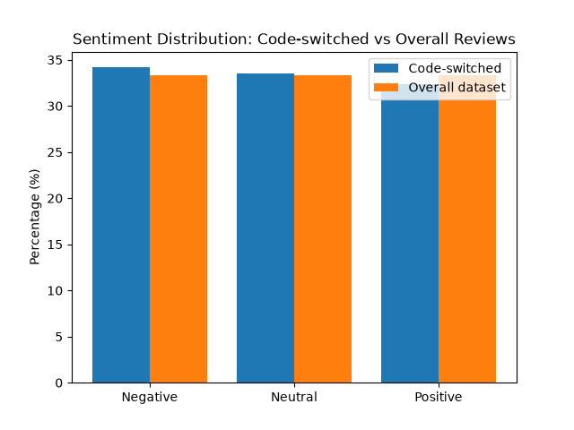

# Code-Switching Sentiment Analysis

A Python project exploring how sentiment relates to Hindi-English code-switching (mixing languages within the same sentence) in product/service reviews.

## Background

This project builds on earlier independent research I conducted on why multilingual speakers often switch to English when expressing emotions rather than using their native language. This project takes that question and tests it quantitatively using real review data.

## What this does

1. Loads a dataset of ~60,000 labeled reviews (Positive/Negative/Neutral) in mixed Bangla/Hindi/English text
2. Detects Hindi-English code-switched text using Unicode script detection (Devanagari + Latin characters in the same sentence)
3. Compares sentiment distribution between code-switched reviews and the overall dataset
4. Visualizes the comparison as a bar chart

## Key finding

Code-switched reviews were slightly more likely to be negative (and less likely to be positive) compared to the dataset overall — a small but measurable pattern (~34% negative vs 33.3% baseline). This is consistent with linguistic research suggesting people may lean toward switching languages when expressing frustration or emotional intensity rather than routine positive sentiment.

## Tech used

- Python
- pandas (data handling)
- matplotlib (visualization)
- Regex/Unicode pattern matching for language detection

## Dataset

[Code Mixed Sentiment (Bangla-English-Hindi)](https://www.kaggle.com/datasets/mdnishatraihan/code-mixed-sentiment-bangla-english-hindi) — Kaggle

## How to run
